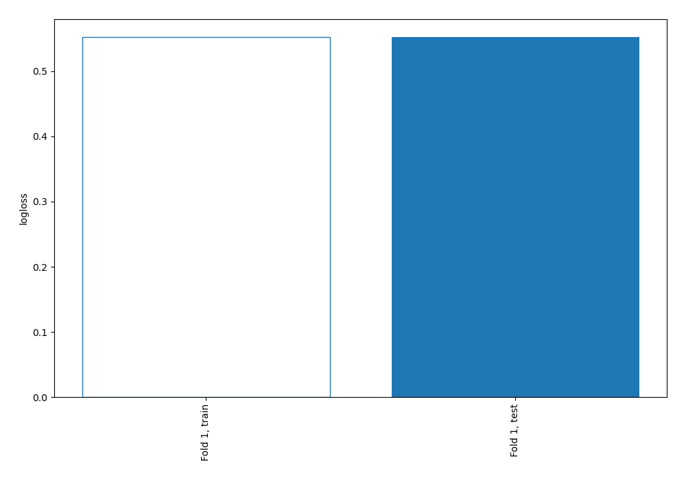
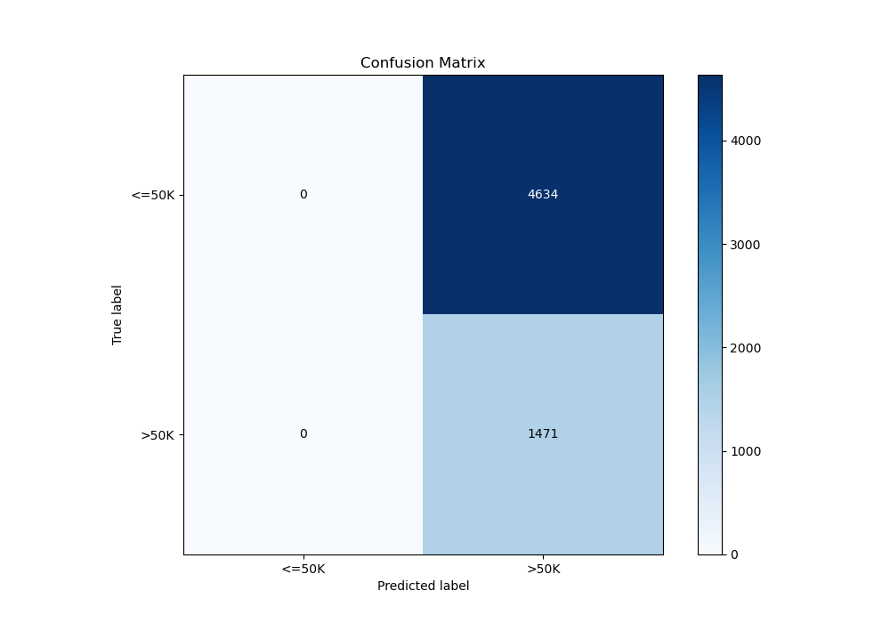
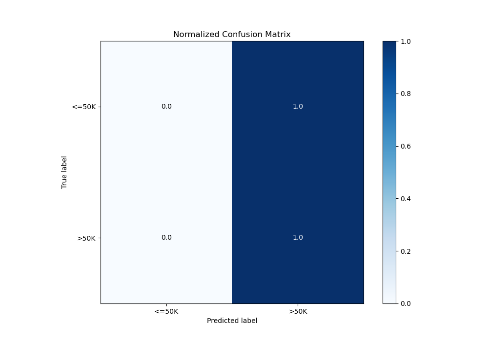
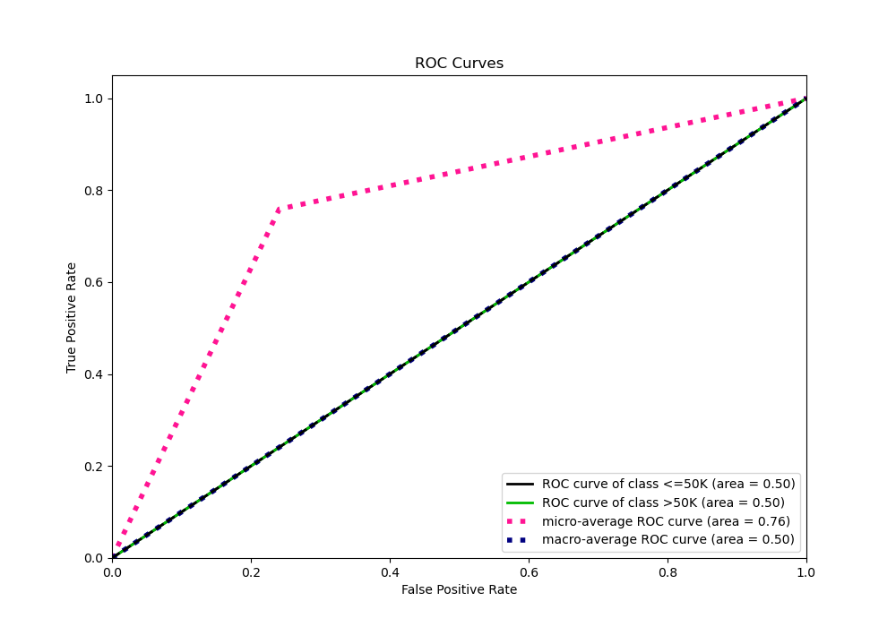
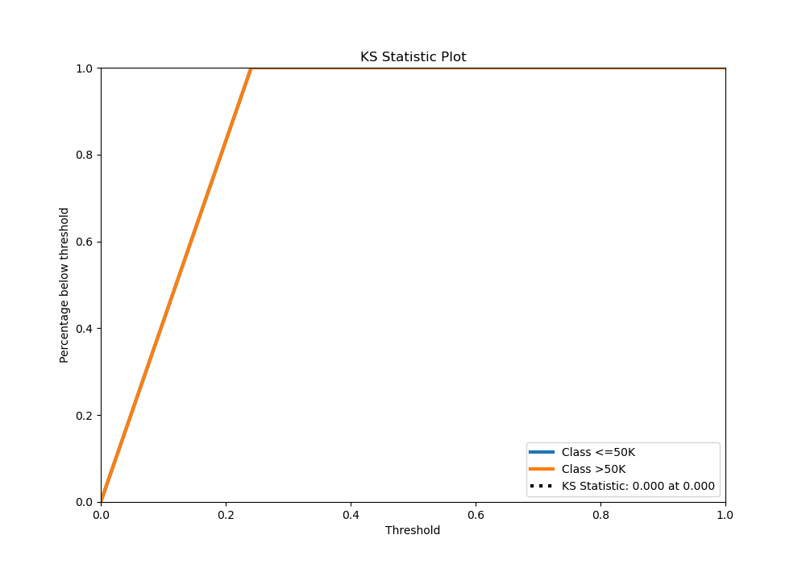
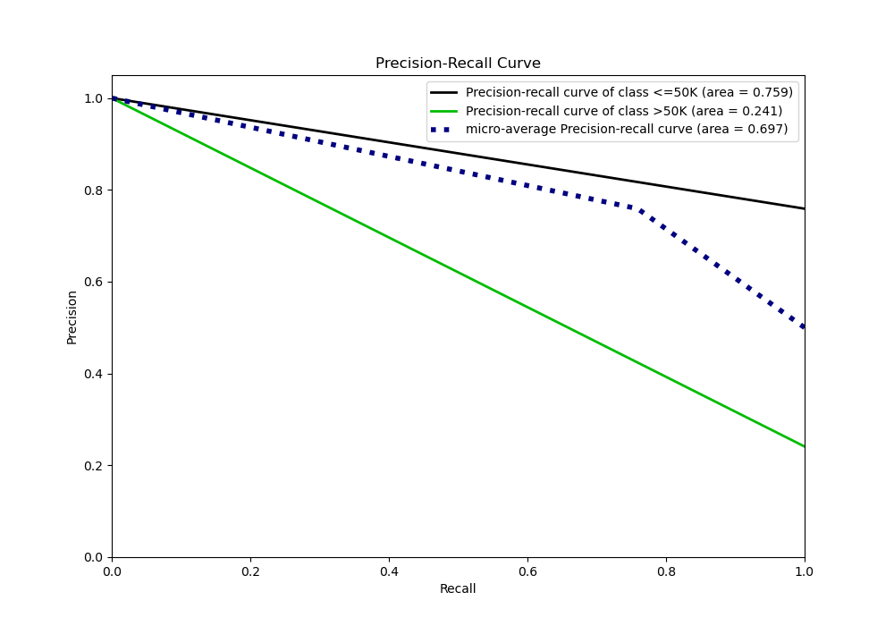

# Summary of 1_Baseline

[<< Go back](../README.md)

## Baseline Classifier (Baseline)
- **n_jobs**: -1
- **explain_level**: 2

## Validation
 - **validation_type**: split
 - **train_ratio**: 0.75
 - **shuffle**: True
 - **stratify**: True

## Optimized metric
logloss

## Training time

0.4 seconds

## Metric details
|           |    score |   threshold |
|:----------|---------:|------------:|
| logloss   | 0.552173 |  nan        |
| auc       | 0.5      |  nan        |
| f1        | 0.388332 |    0.216757 |
| accuracy  | 0.24095  |    0.216757 |
| precision | 0.24095  |    0.216757 |
| recall    | 1        |    0.216757 |
| mcc       | 0        |    0.216757 |

## Metric details with threshold from accuracy metric
|           |    score |   threshold |
|:----------|---------:|------------:|
| logloss   | 0.552173 |  nan        |
| auc       | 0.5      |  nan        |
| f1        | 0.388332 |    0.216757 |
| accuracy  | 0.24095  |    0.216757 |
| precision | 0.24095  |    0.216757 |
| recall    | 1        |    0.216757 |
| mcc       | 0        |    0.216757 |

## Confusion matrix (at threshold=0.216757)
|                  |   Predicted as <=50K |   Predicted as >50K |
|:-----------------|---------------------:|--------------------:|
| Labeled as <=50K |                    0 |                4634 |
| Labeled as >50K  |                    0 |                1471 |

## Learning curves

## Confusion Matrix

## Normalized Confusion Matrix

## ROC Curve

## Kolmogorov-Smirnov Statistic

## Precision-Recall Curve

[<< Go back](../README.md)
