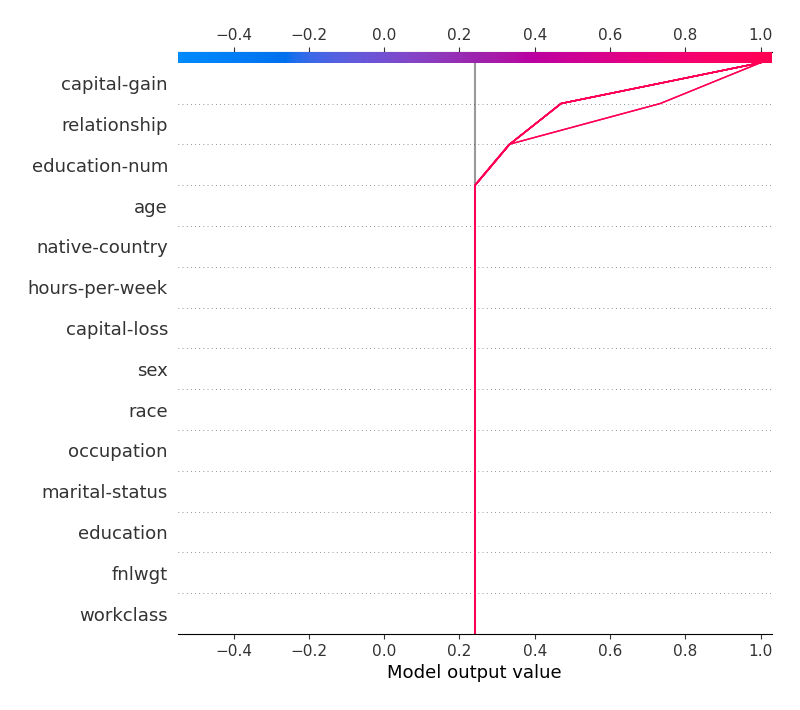

# Summary of 2_DecisionTree

[<< Go back](../README.md)

## Decision Tree
- **n_jobs**: -1
- **criterion**: gini
- **max_depth**: 3
- **explain_level**: 2

## Validation
 - **validation_type**: split
 - **train_ratio**: 0.75
 - **shuffle**: True
 - **stratify**: True

## Optimized metric
logloss

## Training time

16.4 seconds

## Metric details
|           |    score |   threshold |
|:----------|---------:|------------:|
| logloss   | 0.370488 | nan         |
| auc       | 0.849558 | nan         |
| f1        | 0.626353 |   0.362553  |
| accuracy  | 0.844062 |   0.484036  |
| precision | 0.982935 |   0.675132  |
| recall    | 1        |   0.0449771 |
| mcc       | 0.533755 |   0.484036  |

## Metric details with threshold from accuracy metric
|           |    score |   threshold |
|:----------|---------:|------------:|
| logloss   | 0.370488 |  nan        |
| auc       | 0.849558 |  nan        |
| f1        | 0.604979 |    0.484036 |
| accuracy  | 0.844062 |    0.484036 |
| precision | 0.776358 |    0.484036 |
| recall    | 0.495581 |    0.484036 |
| mcc       | 0.533755 |    0.484036 |

## Confusion matrix (at threshold=0.484036)
|                  |   Predicted as <=50K |   Predicted as >50K |
|:-----------------|---------------------:|--------------------:|
| Labeled as <=50K |                 4424 |                 210 |
| Labeled as >50K  |                  742 |                 729 |

## Learning curves

## Permutation-based Importance

## Confusion Matrix

## Normalized Confusion Matrix

## ROC Curve

## Kolmogorov-Smirnov Statistic

## Precision-Recall Curve

## SHAP Importance

## SHAP Dependence plots

### Dependence (Fold 1)

## SHAP Decision plots

### Top-10 Worst decisions for class 0 (Fold 1)

### Top-10 Best decisions for class 0 (Fold 1)

### Top-10 Worst decisions for class 1 (Fold 1)

### Top-10 Best decisions for class 1 (Fold 1)

[<< Go back](../README.md)
