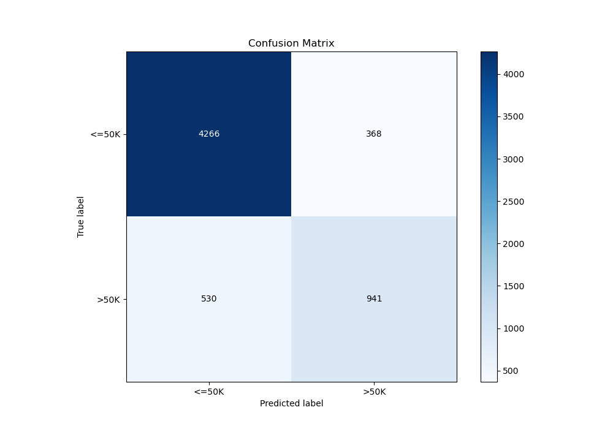

# Summary of 4_Default_NeuralNetwork

[<< Go back](../README.md)

## Neural Network
- **n_jobs**: -1
- **dense_1_size**: 32
- **dense_2_size**: 16
- **learning_rate**: 0.05
- **explain_level**: 2

## Validation
 - **validation_type**: split
 - **train_ratio**: 0.75
 - **shuffle**: True
 - **stratify**: True

## Optimized metric
logloss

## Training time

6.8 seconds

## Metric details
|           |    score |     threshold |
|:----------|---------:|--------------:|
| logloss   | 0.322764 | nan           |
| auc       | 0.907356 | nan           |
| f1        | 0.692716 |   0.372104    |
| accuracy  | 0.852907 |   0.483809    |
| precision | 0.878089 |   0.705803    |
| recall    | 1        |   1.92973e-08 |
| mcc       | 0.588596 |   0.433428    |

## Metric details with threshold from accuracy metric
|           |    score |   threshold |
|:----------|---------:|------------:|
| logloss   | 0.322764 |  nan        |
| auc       | 0.907356 |  nan        |
| f1        | 0.676978 |    0.483809 |
| accuracy  | 0.852907 |    0.483809 |
| precision | 0.718869 |    0.483809 |
| recall    | 0.639701 |    0.483809 |
| mcc       | 0.58383  |    0.483809 |

## Confusion matrix (at threshold=0.483809)
|                  |   Predicted as <=50K |   Predicted as >50K |
|:-----------------|---------------------:|--------------------:|
| Labeled as <=50K |                 4266 |                 368 |
| Labeled as >50K  |                  530 |                 941 |

## Learning curves

## Permutation-based Importance

## Confusion Matrix

## Normalized Confusion Matrix

## ROC Curve

## Kolmogorov-Smirnov Statistic

## Precision-Recall Curve

[<< Go back](../README.md)
