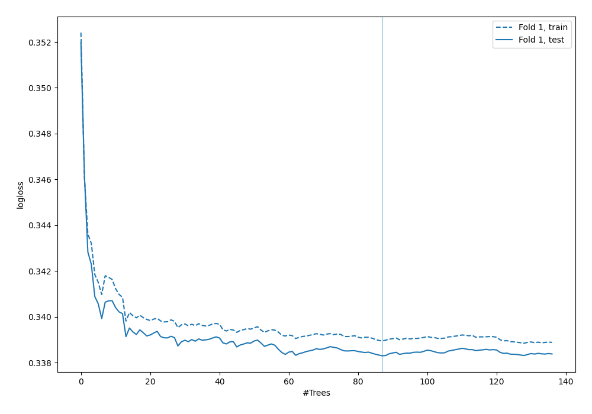

# Summary of 5_Default_RandomForest

[<< Go back](../README.md)

## Random Forest
- **n_jobs**: -1
- **criterion**: gini
- **max_features**: 0.9
- **min_samples_split**: 30
- **max_depth**: 4
- **eval_metric_name**: logloss
- **explain_level**: 2

## Validation
 - **validation_type**: split
 - **train_ratio**: 0.75
 - **shuffle**: True
 - **stratify**: True

## Optimized metric
logloss

## Training time

8.5 seconds

## Metric details
|           |    score |   threshold |
|:----------|---------:|------------:|
| logloss   | 0.338298 |  nan        |
| auc       | 0.893187 |  nan        |
| f1        | 0.676092 |    0.312873 |
| accuracy  | 0.851269 |    0.42416  |
| precision | 0.986226 |    0.755748 |
| recall    | 1        |    0.030391 |
| mcc       | 0.565725 |    0.312873 |

## Metric details with threshold from accuracy metric
|           |    score |   threshold |
|:----------|---------:|------------:|
| logloss   | 0.338298 |   nan       |
| auc       | 0.893187 |   nan       |
| f1        | 0.648335 |     0.42416 |
| accuracy  | 0.851269 |     0.42416 |
| precision | 0.753375 |     0.42416 |
| recall    | 0.569001 |     0.42416 |
| mcc       | 0.565151 |     0.42416 |

## Confusion matrix (at threshold=0.42416)
|                  |   Predicted as <=50K |   Predicted as >50K |
|:-----------------|---------------------:|--------------------:|
| Labeled as <=50K |                 4360 |                 274 |
| Labeled as >50K  |                  634 |                 837 |

## Learning curves

## Permutation-based Importance

## Confusion Matrix

## Normalized Confusion Matrix

## ROC Curve

## Kolmogorov-Smirnov Statistic

## Precision-Recall Curve

## SHAP Importance

## SHAP Dependence plots

### Dependence (Fold 1)

## SHAP Decision plots

### Top-10 Worst decisions for class 0 (Fold 1)

### Top-10 Best decisions for class 0 (Fold 1)

### Top-10 Worst decisions for class 1 (Fold 1)

### Top-10 Best decisions for class 1 (Fold 1)

[<< Go back](../README.md)
