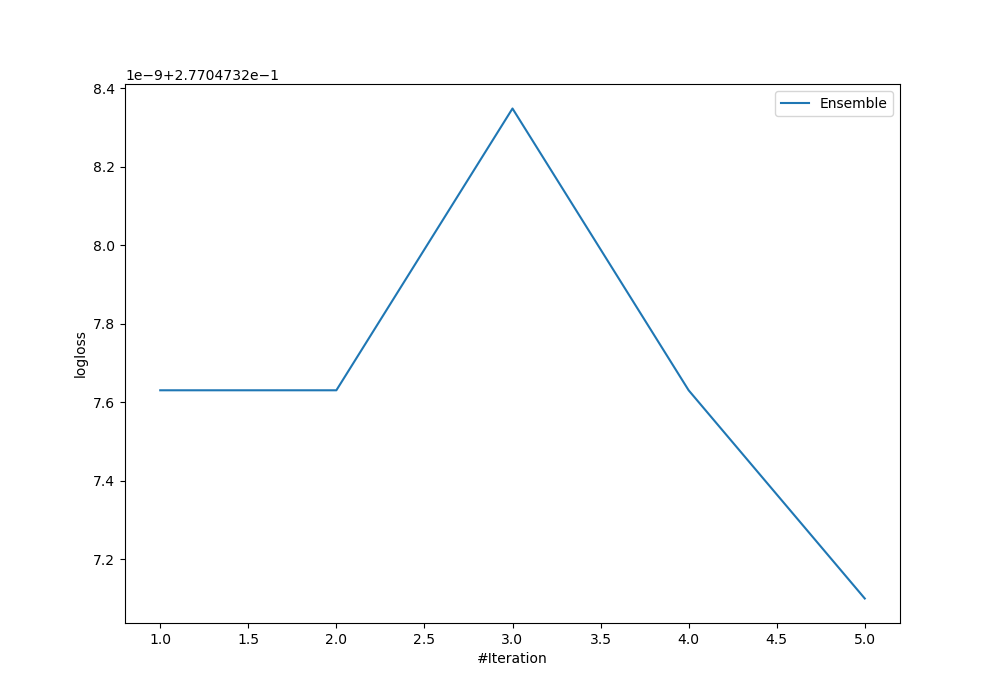
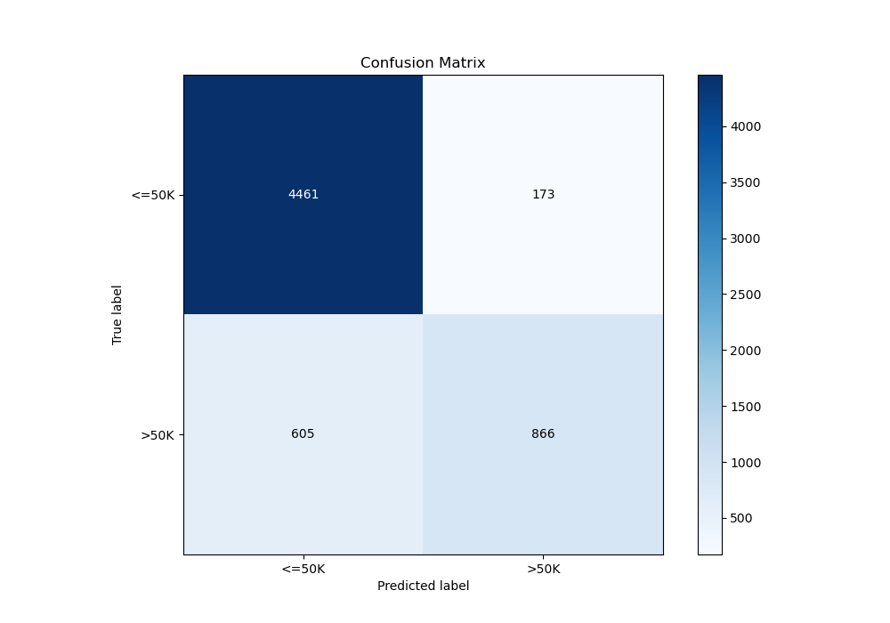
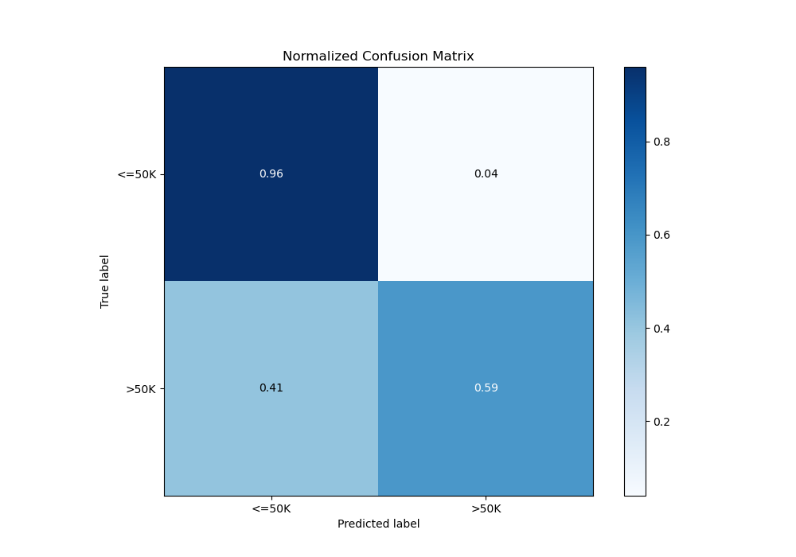
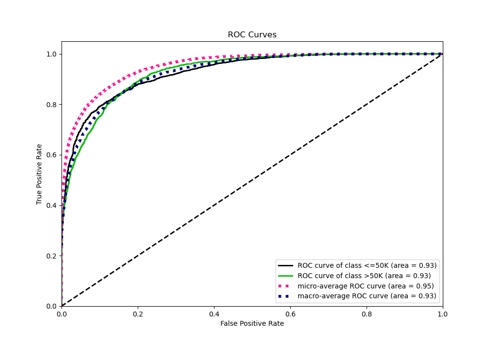
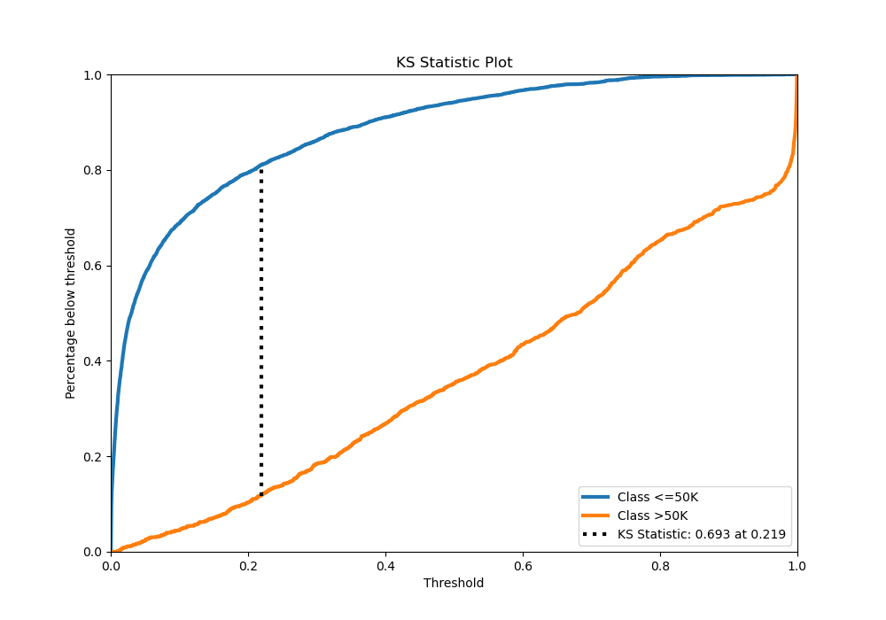
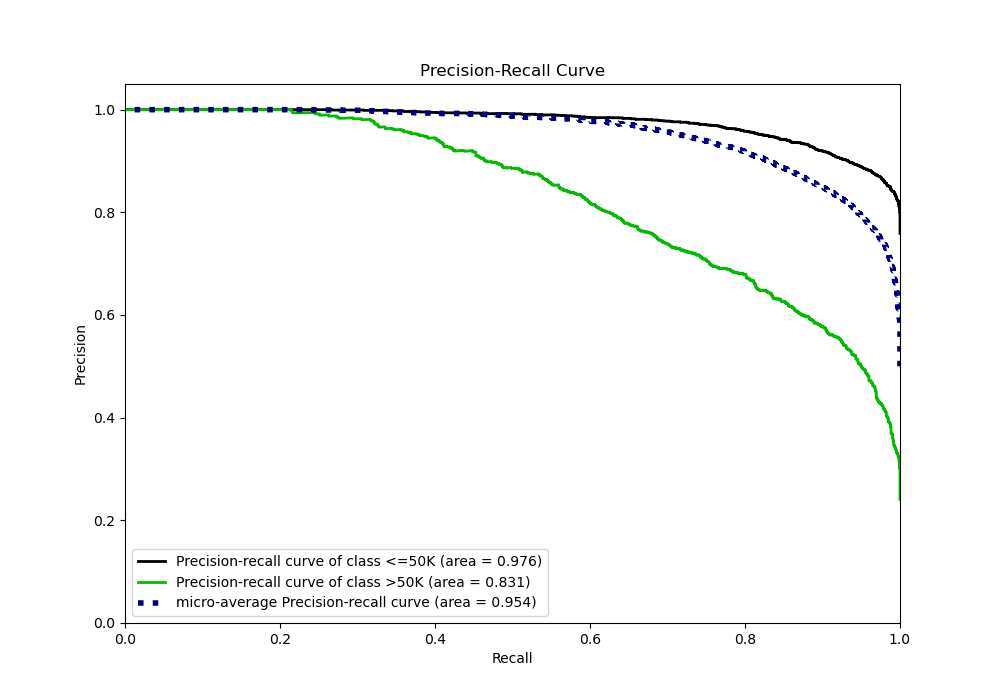

# Summary of Ensemble

[<< Go back](../README.md)

## Ensemble structure
| Model             |   Weight |
|:------------------|---------:|
| 3_Default_Xgboost |        5 |

## Metric details
|           |    score |     threshold |
|:----------|---------:|--------------:|
| logloss   | 0.277047 | nan           |
| auc       | 0.928549 | nan           |
| f1        | 0.734439 |   0.330315    |
| accuracy  | 0.872563 |   0.583852    |
| precision | 0.933539 |   0.748804    |
| recall    | 1        |   7.24841e-05 |
| mcc       | 0.64481  |   0.330315    |

## Metric details with threshold from accuracy metric
|           |    score |   threshold |
|:----------|---------:|------------:|
| logloss   | 0.277047 |  nan        |
| auc       | 0.928549 |  nan        |
| f1        | 0.69004  |    0.583852 |
| accuracy  | 0.872563 |    0.583852 |
| precision | 0.833494 |    0.583852 |
| recall    | 0.588715 |    0.583852 |
| mcc       | 0.627476 |    0.583852 |

## Confusion matrix (at threshold=0.583852)
|                  |   Predicted as <=50K |   Predicted as >50K |
|:-----------------|---------------------:|--------------------:|
| Labeled as <=50K |                 4461 |                 173 |
| Labeled as >50K  |                  605 |                 866 |

## Learning curves

## Confusion Matrix

## Normalized Confusion Matrix

## ROC Curve

## Kolmogorov-Smirnov Statistic

## Precision-Recall Curve

[<< Go back](../README.md)
