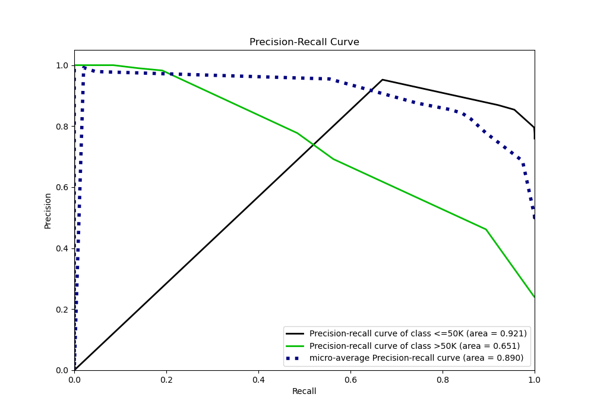

# Summary of 2_DecisionTree

[<< Go back](../README.md)

## Decision Tree
- **n_jobs**: -1
- **criterion**: gini
- **max_depth**: 3
- **explain_level**: 2

## Validation
 - **validation_type**: split
 - **train_ratio**: 0.75
 - **shuffle**: True
 - **stratify**: True

## Optimized metric
logloss

## Training time

4.9 seconds

## Metric details
|           |    score |   threshold |
|:----------|---------:|------------:|
| logloss   | 0.367442 |  nan        |
| auc       | 0.850153 |  nan        |
| f1        | 0.620871 |    0.36065  |
| accuracy  | 0.842588 |    0.517192 |
| precision | 0.982517 |    0.828917 |
| recall    | 0.999319 |    0        |
| mcc       | 0.527493 |    0.517192 |

## Metric details with threshold from accuracy metric
|           |    score |   threshold |
|:----------|---------:|------------:|
| logloss   | 0.367442 |  nan        |
| auc       | 0.850153 |  nan        |
| f1        | 0.597065 |    0.517192 |
| accuracy  | 0.842588 |    0.517192 |
| precision | 0.777293 |    0.517192 |
| recall    | 0.484683 |    0.517192 |
| mcc       | 0.527493 |    0.517192 |

## Confusion matrix (at threshold=0.517192)
|                  |   Predicted as <=50K |   Predicted as >50K |
|:-----------------|---------------------:|--------------------:|
| Labeled as <=50K |                 4432 |                 204 |
| Labeled as >50K  |                  757 |                 712 |

## Learning curves

## Permutation-based Importance

## Confusion Matrix

## Normalized Confusion Matrix

## ROC Curve

## Kolmogorov-Smirnov Statistic

## Precision-Recall Curve

## SHAP Importance

## SHAP Dependence plots

### Dependence (Fold 1)

## SHAP Decision plots

### Top-10 Worst decisions for class 0 (Fold 1)

### Top-10 Best decisions for class 0 (Fold 1)

### Top-10 Worst decisions for class 1 (Fold 1)

### Top-10 Best decisions for class 1 (Fold 1)

[<< Go back](../README.md)
