# Summary of 3_Default_Xgboost

[<< Go back](../README.md)

## Extreme Gradient Boosting (Xgboost)
- **n_jobs**: -1
- **objective**: binary:logistic
- **eta**: 0.075
- **max_depth**: 6
- **min_child_weight**: 1
- **subsample**: 1.0
- **colsample_bytree**: 1.0
- **eval_metric**: logloss
- **explain_level**: 2

## Validation
 - **validation_type**: split
 - **train_ratio**: 0.75
 - **shuffle**: True
 - **stratify**: True

## Optimized metric
logloss

## Training time

7.5 seconds

## Metric details
|           |    score |     threshold |
|:----------|---------:|--------------:|
| logloss   | 0.276031 | nan           |
| auc       | 0.929559 | nan           |
| f1        | 0.733208 |   0.348398    |
| accuracy  | 0.875839 |   0.531985    |
| precision | 0.982673 |   0.922393    |
| recall    | 1        |   1.27906e-05 |
| mcc       | 0.649012 |   0.461567    |

## Metric details with threshold from accuracy metric
|           |    score |   threshold |
|:----------|---------:|------------:|
| logloss   | 0.276031 |  nan        |
| auc       | 0.929559 |  nan        |
| f1        | 0.714393 |    0.531985 |
| accuracy  | 0.875839 |    0.531985 |
| precision | 0.8      |    0.531985 |
| recall    | 0.645337 |    0.531985 |
| mcc       | 0.642221 |    0.531985 |

## Confusion matrix (at threshold=0.531985)
|                  |   Predicted as <=50K |   Predicted as >50K |
|:-----------------|---------------------:|--------------------:|
| Labeled as <=50K |                 4399 |                 237 |
| Labeled as >50K  |                  521 |                 948 |

## Learning curves
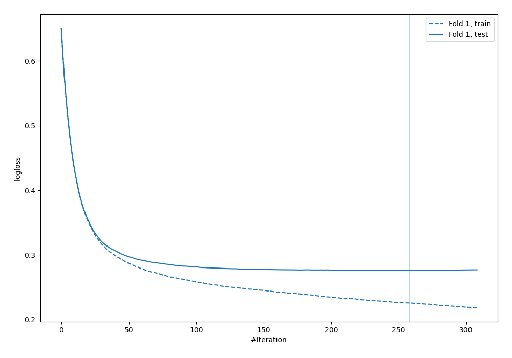

## Permutation-based Importance
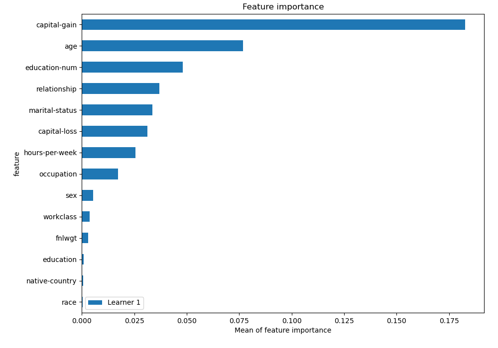
## Confusion Matrix

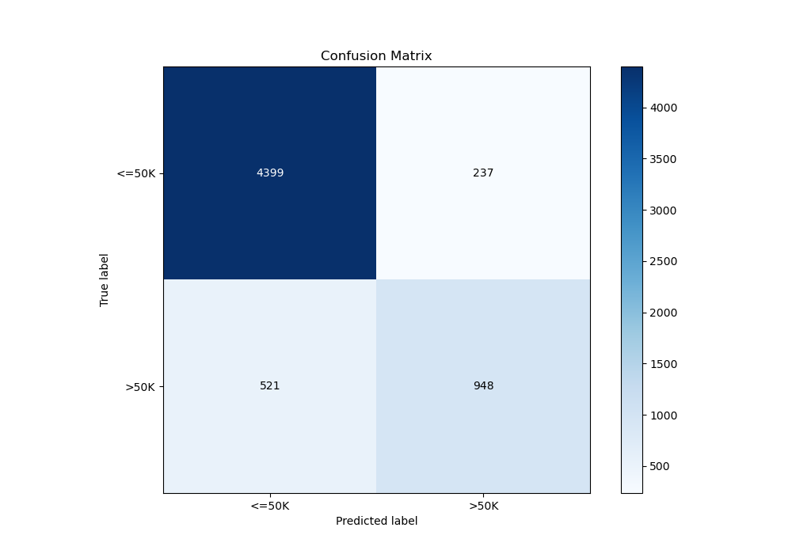

## Normalized Confusion Matrix

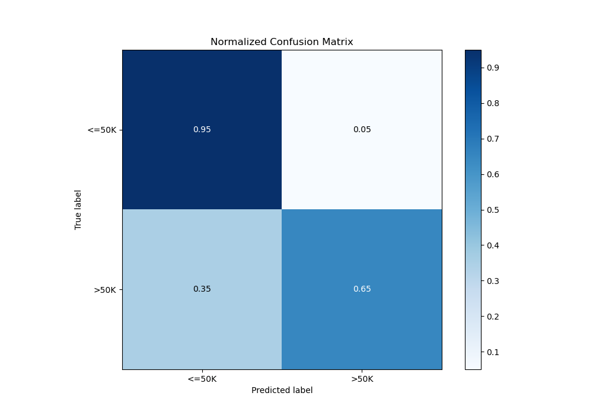

## ROC Curve

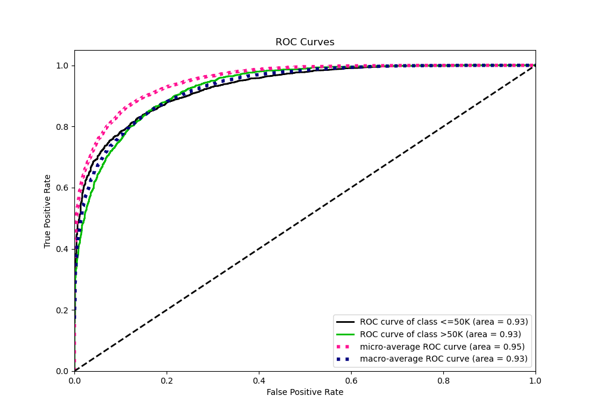

## Kolmogorov-Smirnov Statistic

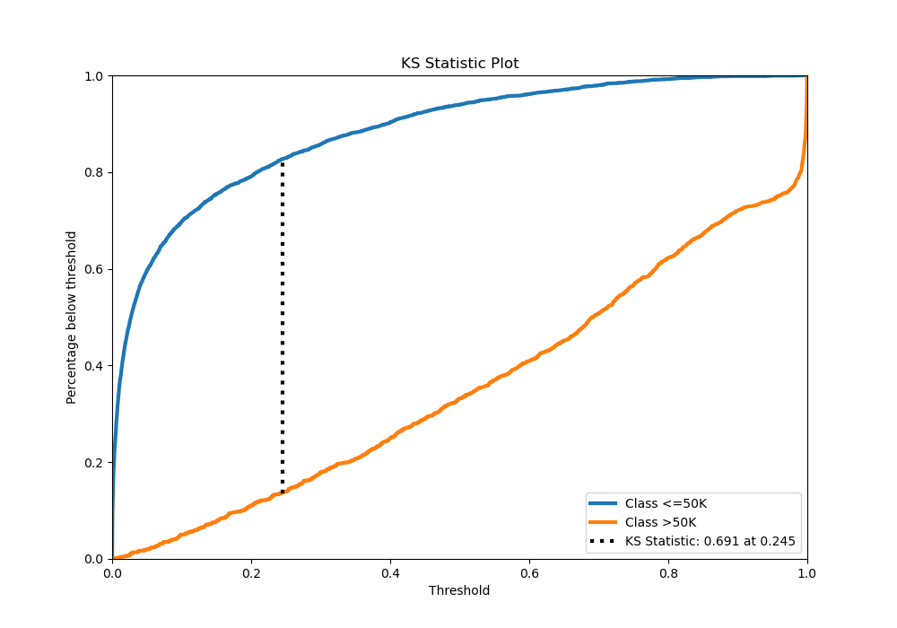

## Precision-Recall Curve

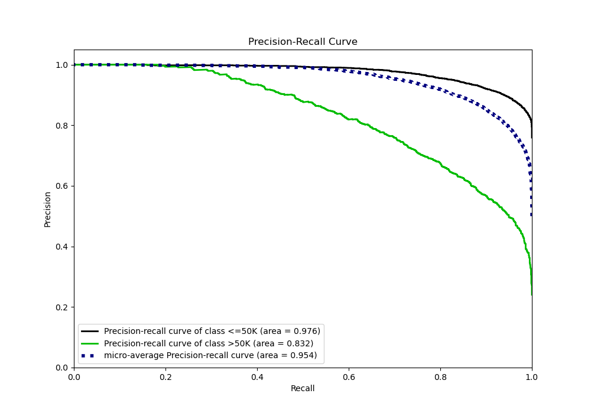

## SHAP Importance
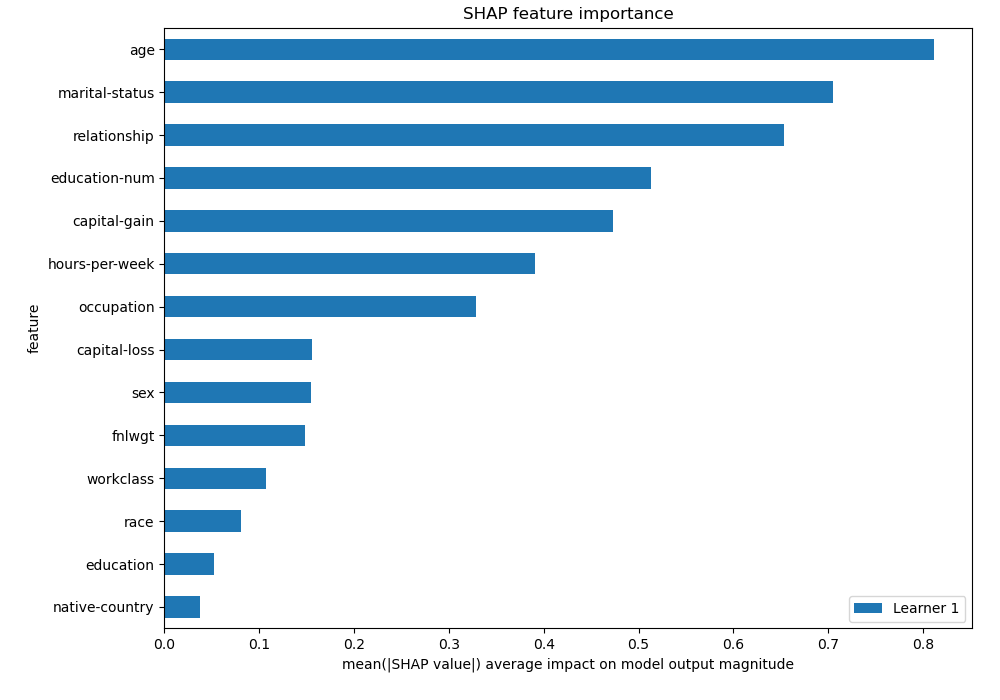

## SHAP Dependence plots

### Dependence (Fold 1)
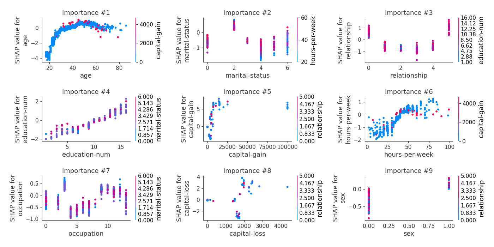

## SHAP Decision plots

### Top-10 Worst decisions for class 0 (Fold 1)
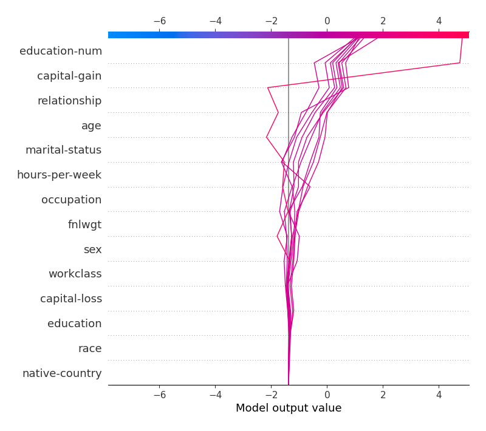
### Top-10 Best decisions for class 0 (Fold 1)
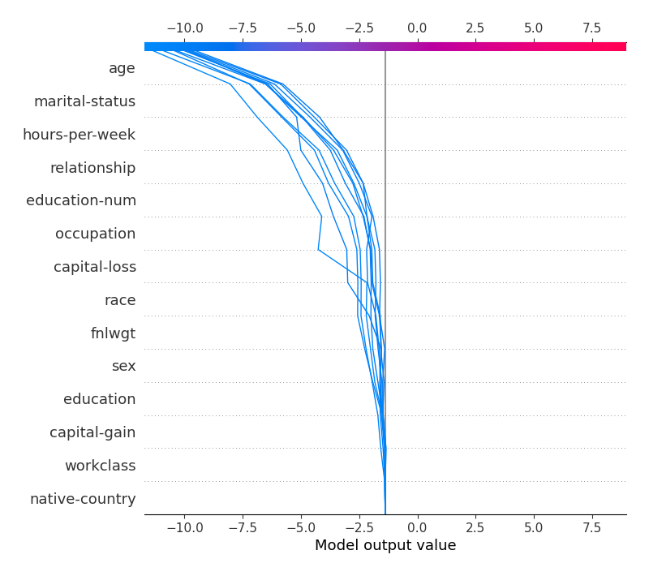
### Top-10 Worst decisions for class 1 (Fold 1)
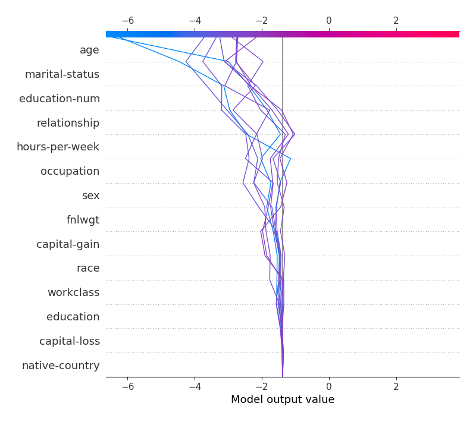
### Top-10 Best decisions for class 1 (Fold 1)
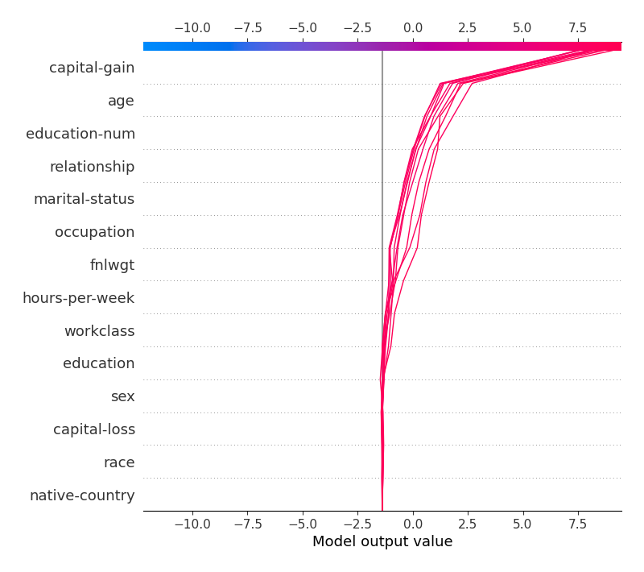

[<< Go back](../README.md)
