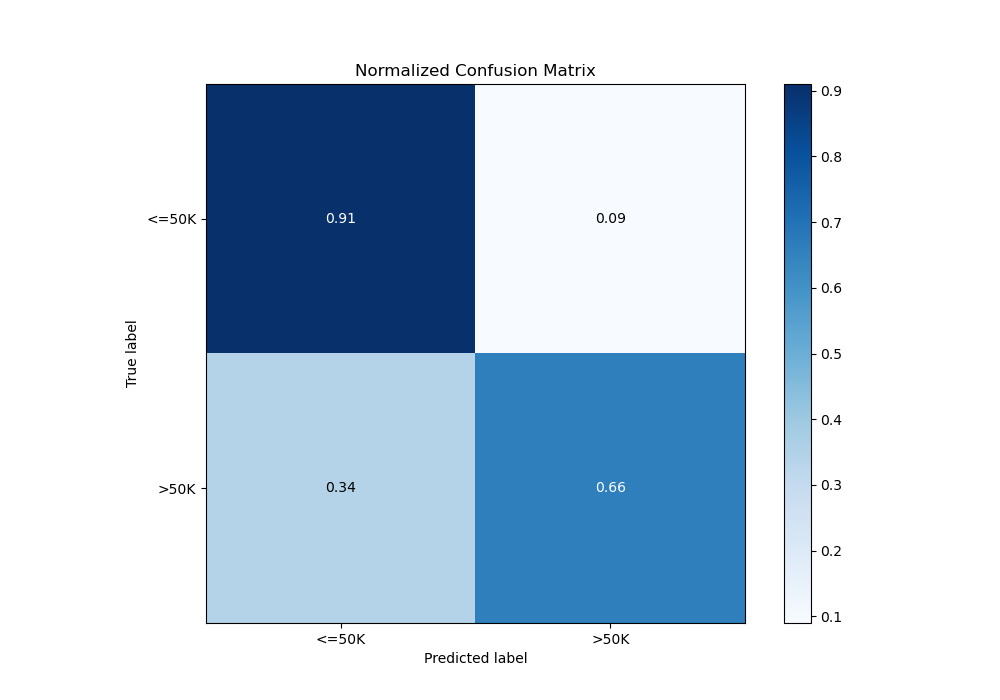

# Summary of 4_Default_NeuralNetwork

[<< Go back](../README.md)

## Neural Network
- **n_jobs**: -1
- **dense_1_size**: 32
- **dense_2_size**: 16
- **learning_rate**: 0.05
- **explain_level**: 2

## Validation
 - **validation_type**: split
 - **train_ratio**: 0.75
 - **shuffle**: True
 - **stratify**: True

## Optimized metric
logloss

## Training time

6.9 seconds

## Metric details
|           |    score |     threshold |
|:----------|---------:|--------------:|
| logloss   | 0.320872 | nan           |
| auc       | 0.902967 | nan           |
| f1        | 0.68559  |   0.359945    |
| accuracy  | 0.848321 |   0.451752    |
| precision | 0.983221 |   0.916189    |
| recall    | 1        |   3.90869e-06 |
| mcc       | 0.578745 |   0.447147    |

## Metric details with threshold from accuracy metric
|           |    score |   threshold |
|:----------|---------:|------------:|
| logloss   | 0.320872 |  nan        |
| auc       | 0.902967 |  nan        |
| f1        | 0.676224 |    0.451752 |
| accuracy  | 0.848321 |    0.451752 |
| precision | 0.695183 |    0.451752 |
| recall    | 0.658271 |    0.451752 |
| mcc       | 0.577649 |    0.451752 |

## Confusion matrix (at threshold=0.451752)
|                  |   Predicted as <=50K |   Predicted as >50K |
|:-----------------|---------------------:|--------------------:|
| Labeled as <=50K |                 4212 |                 424 |
| Labeled as >50K  |                  502 |                 967 |

## Learning curves

## Permutation-based Importance

## Confusion Matrix

## Normalized Confusion Matrix

## ROC Curve

## Kolmogorov-Smirnov Statistic

## Precision-Recall Curve

[<< Go back](../README.md)
