# Summary of 5_Default_RandomForest

[<< Go back](../README.md)

## Random Forest
- **n_jobs**: -1
- **criterion**: gini
- **max_features**: 0.9
- **min_samples_split**: 30
- **max_depth**: 4
- **eval_metric_name**: logloss
- **explain_level**: 2

## Validation
 - **validation_type**: split
 - **train_ratio**: 0.75
 - **shuffle**: True
 - **stratify**: True

## Optimized metric
logloss

## Training time

5.9 seconds

## Metric details
|           |    score |   threshold |
|:----------|---------:|------------:|
| logloss   | 0.337926 | nan         |
| auc       | 0.890704 | nan         |
| f1        | 0.65597  |   0.320585  |
| accuracy  | 0.853071 |   0.364784  |
| precision | 0.982143 |   0.837883  |
| recall    | 1        |   0.0260954 |
| mcc       | 0.570385 |   0.356425  |

## Metric details with threshold from accuracy metric
|           |    score |   threshold |
|:----------|---------:|------------:|
| logloss   | 0.337926 |  nan        |
| auc       | 0.890704 |  nan        |
| f1        | 0.651109 |    0.364784 |
| accuracy  | 0.853071 |    0.364784 |
| precision | 0.759528 |    0.364784 |
| recall    | 0.569775 |    0.364784 |
| mcc       | 0.569727 |    0.364784 |

## Confusion matrix (at threshold=0.364784)
|                  |   Predicted as <=50K |   Predicted as >50K |
|:-----------------|---------------------:|--------------------:|
| Labeled as <=50K |                 4371 |                 265 |
| Labeled as >50K  |                  632 |                 837 |

## Learning curves
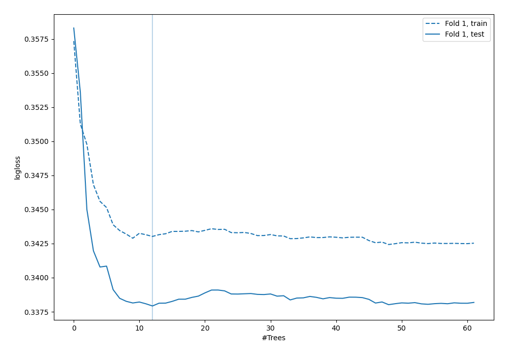

## Permutation-based Importance

## Confusion Matrix

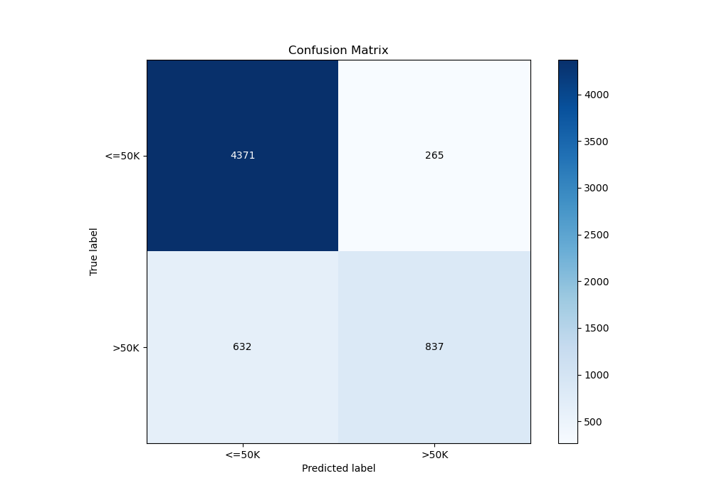

## Normalized Confusion Matrix

## ROC Curve

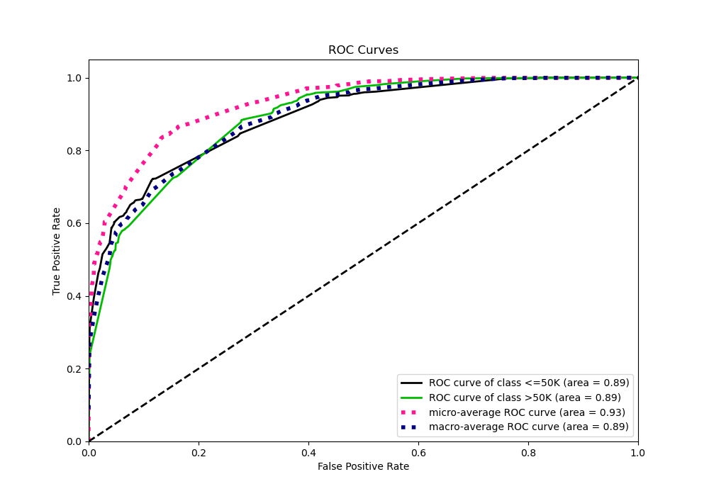

## Kolmogorov-Smirnov Statistic

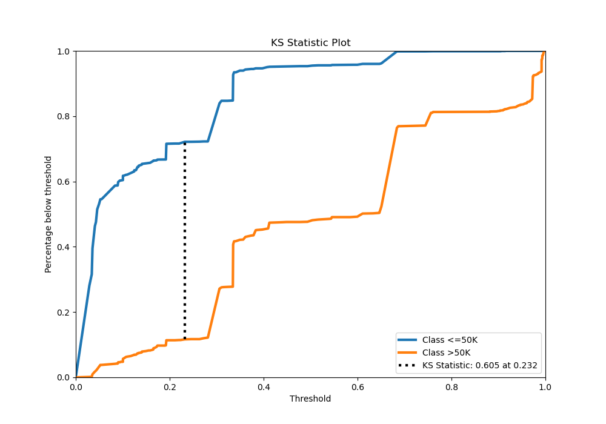

## Precision-Recall Curve

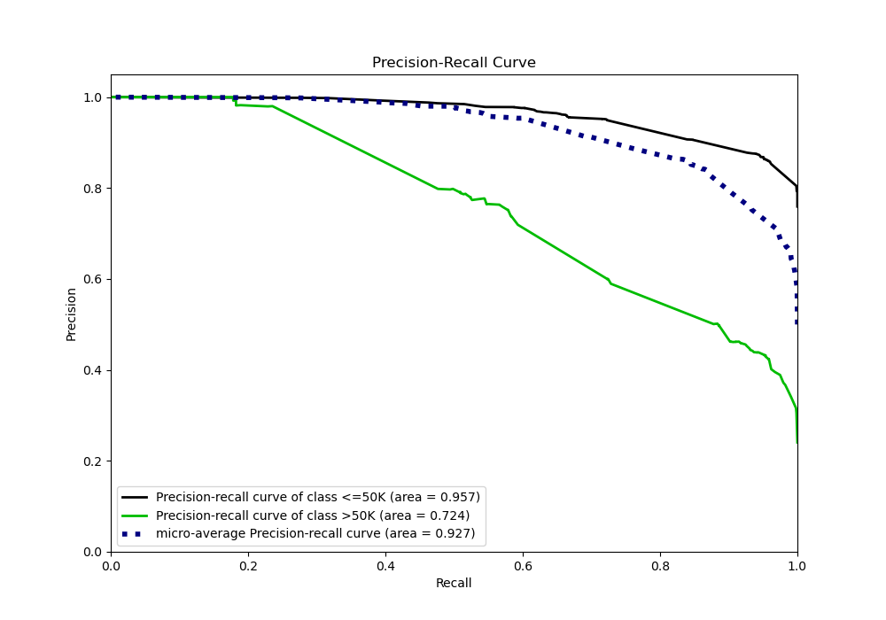

## SHAP Importance
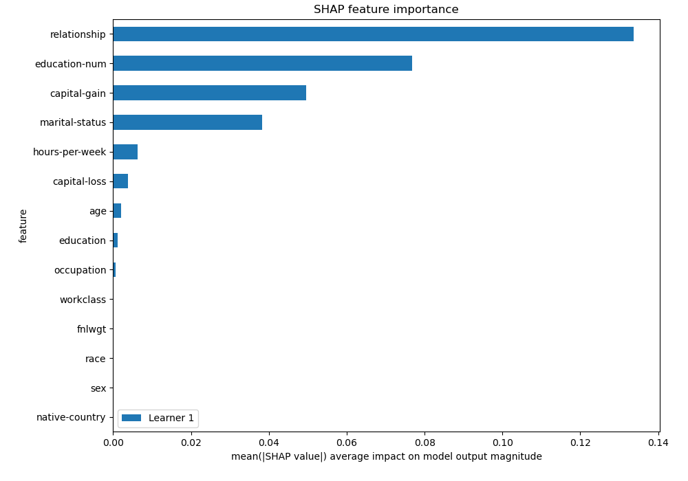

## SHAP Dependence plots

### Dependence (Fold 1)
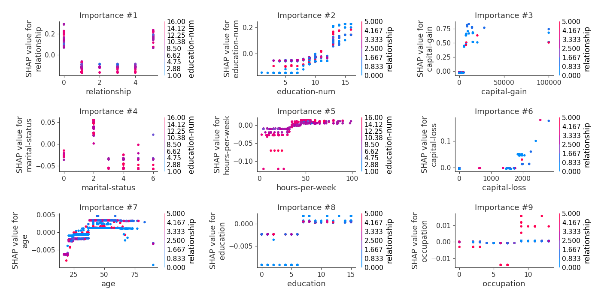

## SHAP Decision plots

### Top-10 Worst decisions for class 0 (Fold 1)
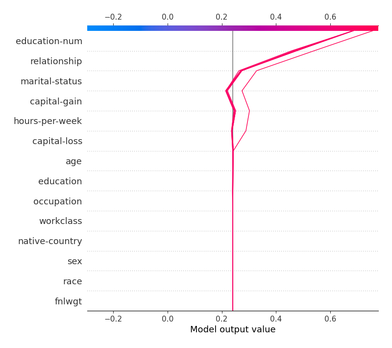
### Top-10 Best decisions for class 0 (Fold 1)
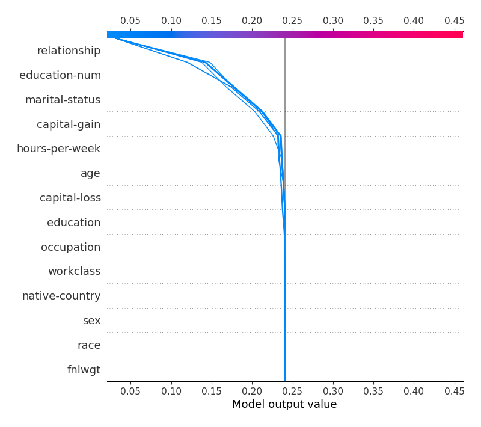
### Top-10 Worst decisions for class 1 (Fold 1)
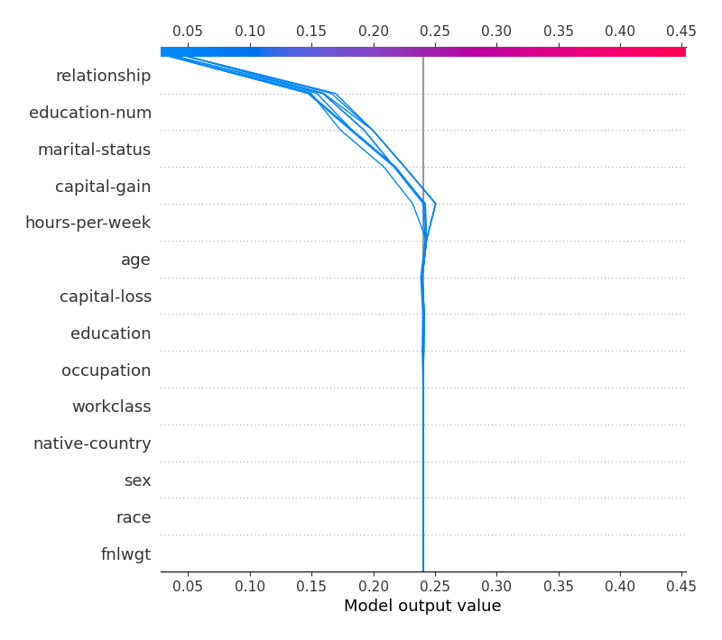
### Top-10 Best decisions for class 1 (Fold 1)
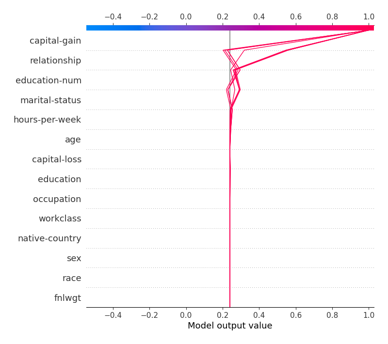

[<< Go back](../README.md)
