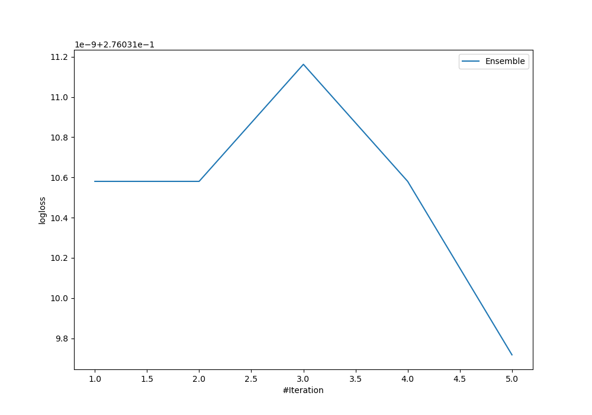
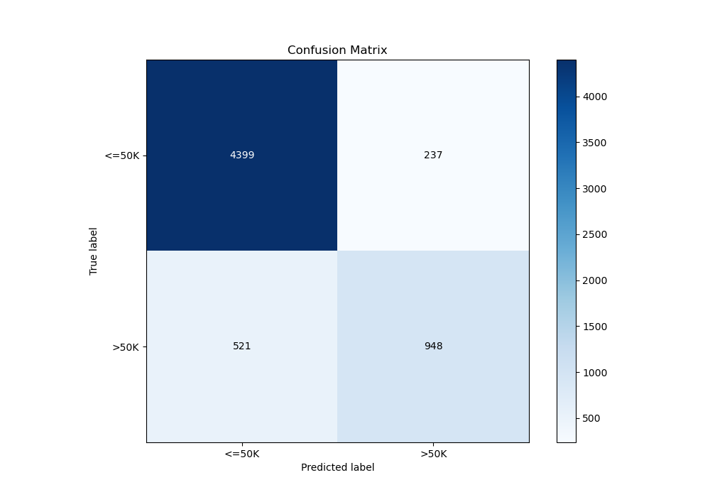
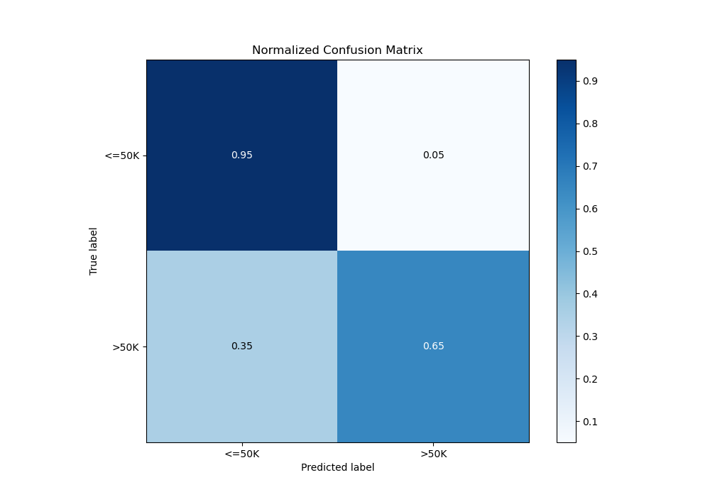
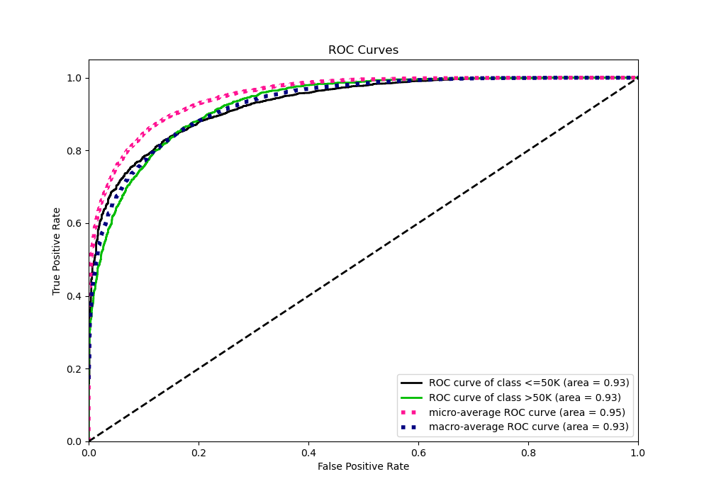
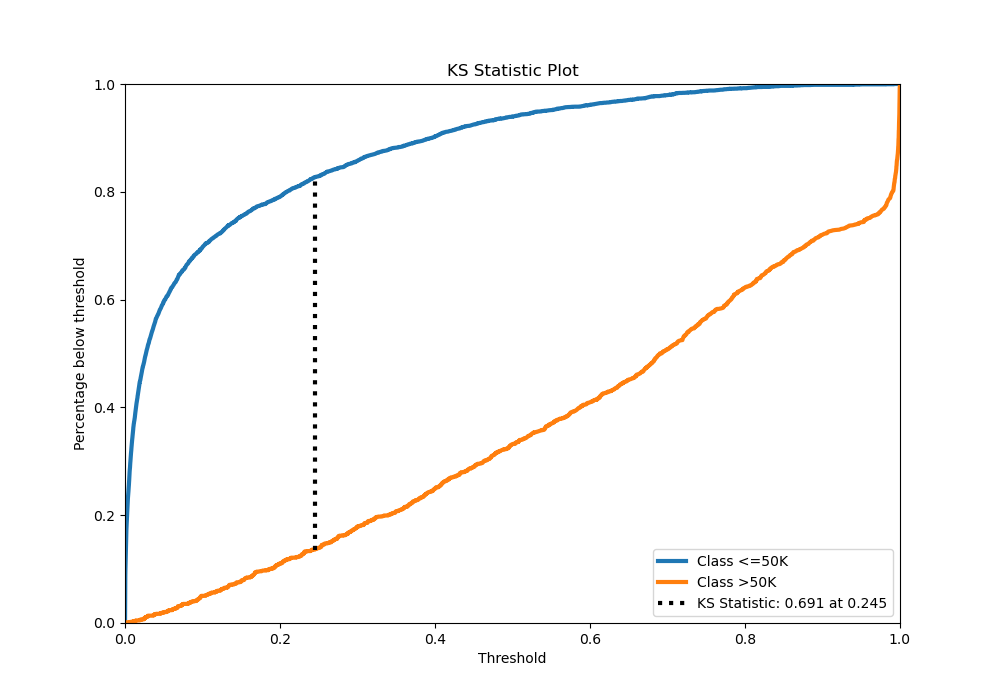
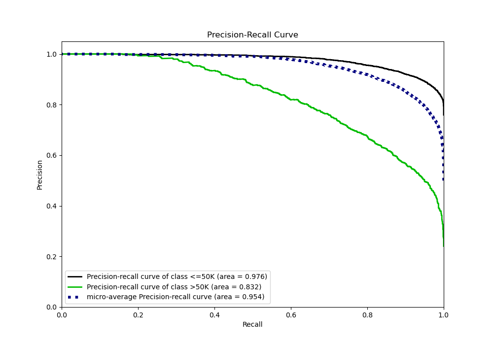

# Summary of Ensemble

[<< Go back](../README.md)

## Ensemble structure
| Model             |   Weight |
|:------------------|---------:|
| 3_Default_Xgboost |        5 |

## Metric details
|           |    score |     threshold |
|:----------|---------:|--------------:|
| logloss   | 0.276031 | nan           |
| auc       | 0.929559 | nan           |
| f1        | 0.733208 |   0.348398    |
| accuracy  | 0.875839 |   0.531985    |
| precision | 0.982673 |   0.922393    |
| recall    | 1        |   1.27906e-05 |
| mcc       | 0.649012 |   0.461567    |

## Metric details with threshold from accuracy metric
|           |    score |   threshold |
|:----------|---------:|------------:|
| logloss   | 0.276031 |  nan        |
| auc       | 0.929559 |  nan        |
| f1        | 0.714393 |    0.531985 |
| accuracy  | 0.875839 |    0.531985 |
| precision | 0.8      |    0.531985 |
| recall    | 0.645337 |    0.531985 |
| mcc       | 0.642221 |    0.531985 |

## Confusion matrix (at threshold=0.531985)
|                  |   Predicted as <=50K |   Predicted as >50K |
|:-----------------|---------------------:|--------------------:|
| Labeled as <=50K |                 4399 |                 237 |
| Labeled as >50K  |                  521 |                 948 |

## Learning curves

## Confusion Matrix

## Normalized Confusion Matrix

## ROC Curve

## Kolmogorov-Smirnov Statistic

## Precision-Recall Curve

[<< Go back](../README.md)
